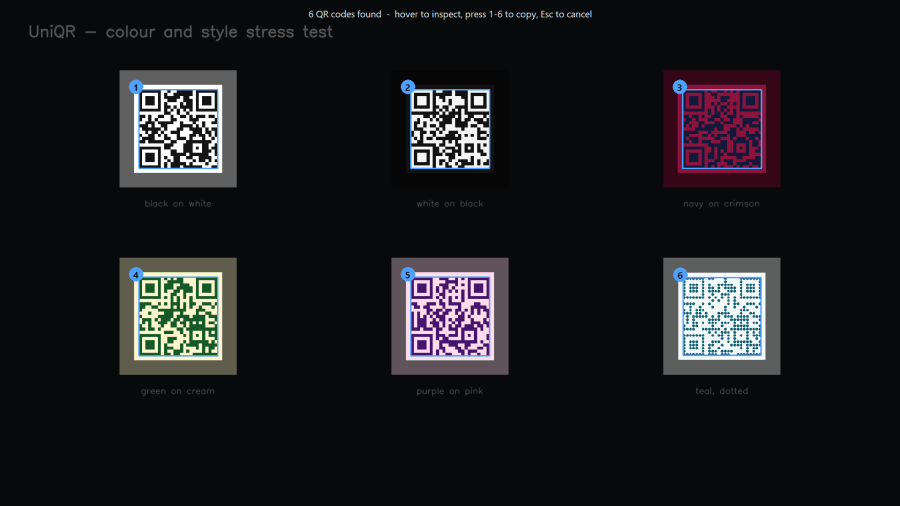

# UniQR

Read any QR code on your screen with a keypress. No phone, no screenshots.



Press **Win+Shift+Q**. UniQR finds every QR code on your screen and decodes it.
Works in a browser, a PDF, a Zoom call, a paused video, a photo of a flyer.

- One code found: it goes straight to your clipboard.
- Several found: you get a picker so you choose which one.

## Install

You need Python 3.11 or newer.

```
pip install -r requirements.txt
```

```
python app.py
```

UniQR sits in the system tray. Right-click the tray icon to quit.

The hotkey on Windows is `Win+Shift+Q`. If another app already owns it, UniQR
tries `Ctrl+Alt+Q`, then `Ctrl+Shift+9`. On macOS and Linux it uses
`Ctrl+Alt+Q`. It prints the one it got when it starts.

To pick your own hotkey, set `UNIQR_HOTKEY`. Useful inside a virtual machine,
where the hypervisor often steals `Ctrl+Alt`:

```
UNIQR_HOTKEY='<cmd>+<shift>+8' python app.py
```

## What happens when you press it

| You see | UniQR does this |
|---|---|
| One code | Copies it. Shows a small card with an **Open** button. |
| Several codes | Dims the screen, numbers each code. Hover, click, or press 1 to 9. |
| No code | Shows a short "nothing found" card by your mouse. |
| Not a web link | Copies only. No Open button. See [Safety](#safety). |

The card and the picker are normal windows, not system notifications. So they
still appear when Do Not Disturb is on.

## Scan an image file instead

```
python scan.py photo.png
```

Two extra options:

```
python scan.py photo.png --exhaustive
```

```
python scan.py --selftest
```

`--exhaustive` is slower but tries much harder. `--selftest` checks the engine
without needing a screen.

`--save` writes the captured image to a file, which is useful when you need to
debug why a code was not found or share a capture with someone helping you:

```
python scan.py --save capture.png
```

You can then scan that file back with `python scan.py capture.png` or attach it
to a bug report.

## Safety

A QR code is untrusted input. It is a stranger's writing, and you are pointing
your computer at it.

So UniQR only **opens** plain `http://` and `https://` links. Everything else
is copy-only, and you decide what to do with it:

- Wi-Fi passwords
- Contact cards
- `file://` paths
- App links like `ms-settings:`

Nothing is captured until you press the hotkey. No background scanning, no
polling, no history file. Nothing leaves your machine.

## What it can read

Plain codes are easy. These are the harder ones it also handles:

- Dark mode codes, light on a dark background
- Codes at any angle, including a photo taken from the side
- Several codes in one picture, at different sizes
- Fancy advert codes with dotted or rounded blocks and a logo in the middle
- Coloured codes on coloured backgrounds
- Small codes, down to about 45 pixels

Checked against real photos:

```
python tests/test_real_photos.py
```

## Platform support

The detection code is plain OpenCV and runs the same everywhere. Only four
things touch the operating system, and they all sit behind one interface in
`uniqr/backends/`.

| | Windows | macOS | Linux |
|---|---|---|---|
| Detection | ✅ | ✅ | ✅ |
| Scan an image file | ✅ | ✅ | ✅ |
| Live screen capture | ✅ | ⚠️ needs permission | ⚠️ X11 only |
| Global hotkey | ✅ | ⚠️ needs permission | ⚠️ |
| Tray icon | ✅ | ❌ see below | ⚠️ |
| Picker and card | ✅ | ⚠️ untested | ⚠️ untested |

✅ tested · ⚠️ written, not yet run on that system · ❌ known limit

Windows is tested. The macOS and Linux code is written, and its machinery runs
on Windows through `UNIQR_BACKEND=portable`, but it has not been run on a real
Mac or Linux box yet. Expect to fix things.

### macOS

Grant two permissions by hand in **System Settings → Privacy & Security**:

1. **Screen Recording.** Without it, capture returns black frames.
2. **Input Monitoring.** Without it, the hotkey never fires.

Neither one raises an error when missing. They just quietly do nothing, so
UniQR checks the capture on startup and tells you instead of saying "no codes
found".

Grant them to your **terminal app**, not to Python. macOS credits the app that
launched the process. Then quit the terminal fully and reopen it, because the
permission only applies on relaunch.

The tray icon is expected to fail. pystray needs the main thread on macOS and
Tk already has it. The hotkey is the real interface, so UniQR reports the
missing tray and keeps going.

One more difference: pynput watches keys instead of reserving them. Unlike
Windows, it cannot tell that another app already owns a shortcut, so both will
fire.

### Linux

Works on X11. Wayland blocks screen capture and global hotkeys by design, and
that needs a portal based capture path which is not written yet.

### Forcing a backend

```
UNIQR_BACKEND=portable python app.py
```

```
UNIQR_BACKEND=windows python app.py
```

## How it works

```
Win+Shift+Q
    -> capture every monitor
    -> locate and decode with OpenCV, both detectors, both polarities
    -> if that fails, try harder: tiles, upscaling, contrast, colour channels
    -> one code: copy and show a card
       several: show the picker
```

The steps run cheapest first. A plain code on a clean screen takes about
140 ms. The full retry ladder only runs when the cheap passes find nothing, and
costs about 900 ms.
