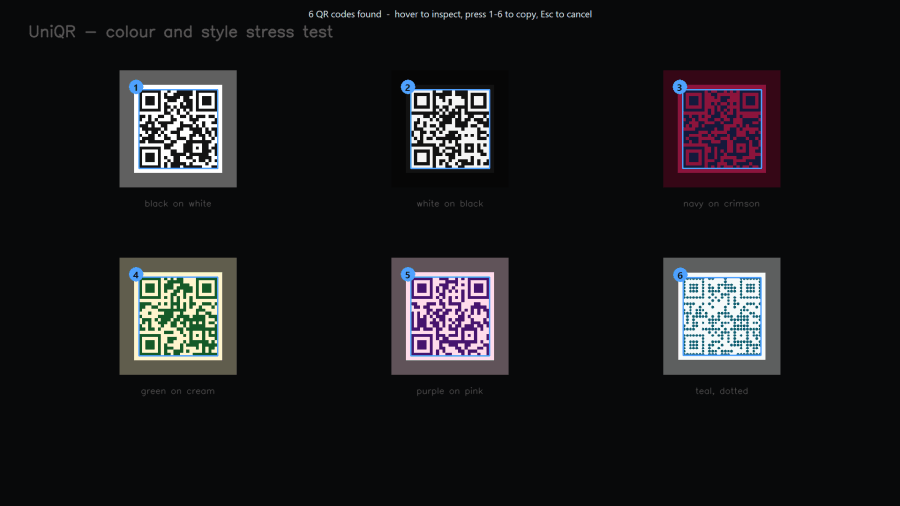

# UniQR

Read any QR code on your screen with a keypress. No phone, no screenshots.
Also reads Data Matrix, Aztec, PDF417 and other 2D codes.



[](https://github.com/pat-selby/uniqr/actions/workflows/ci.yml)

Press **Win+Shift+Q**. UniQR finds every QR code on your screen and decodes it.
Works in a browser, a PDF, a Zoom call, a paused video, a photo of a flyer.

- One code found: it goes straight to your clipboard.
- Several found: you get a picker so you choose which one.

## Highlights

Cross-platform desktop utility with a **multi-stage computer vision pipeline** built on OpenCV. Designed for real-world screen content — dark mode, perspective distortion, stylised marketing codes, and colour-on-colour signage — not just clean printouts.

| Area | Detail |
|---|---|
| **Detection** | Three decoders (OpenCV Aruco + classic, zxing-cpp), seven code types, dual polarity, perspective rectification, adaptive tiling, destylisation and softening for dotted and ring-shaped codes, multi-scale upscaling, three thresholding modes, CLAHE/Otsu/adaptive threshold, red-channel extraction |
| **Architecture** | Platform-neutral CV core behind a backend abstraction (`windows` GDI capture vs `portable` mss/pynput) |
| **Latency** | ~520 ms typical scan, ~880 ms worst-case retry ladder (1920x1080) |
| **Testing** | 203 pytest cases, plus a [benchmark lab](benchmarks/RESULTS.md) that scores about 1,000 generated codes per run across 19 styles and code types, with a separate count of wrong answers |
| **CI** | GitHub Actions matrix: Windows, macOS, Linux × Python 3.11/3.12; ruff + mypy |

## Install

You need Python 3.11 or newer.

```bash
pip install -e ".[windows]"   # Windows (includes pywin32)
pip install -e .                # macOS / Linux
uniqr                         # or: python app.py
```

macOS needs two permissions granted by hand before it can see your screen or
hear the hotkey. **[INSTALL.md](INSTALL.md)** has step-by-step instructions for
each system, how to start UniQR at login, and what to do when something is
wrong.

Legacy install still works:

```bash
pip install -r requirements.txt
python app.py
```

UniQR sits in the system tray. Right-click the tray icon to quit.

The hotkey on Windows is `Win+Shift+Q`. If another app already owns it, UniQR
tries `Ctrl+Alt+Q`, then `Ctrl+Shift+9`. On macOS and Linux it uses
`Ctrl+Alt+Q`. It prints the one it got when it starts.

To pick your own hotkey, set `UNIQR_HOTKEY`. Useful inside a virtual machine,
where the hypervisor often steals `Ctrl+Alt`:

```bash
UNIQR_HOTKEY='<cmd>+<shift>+8' python app.py
```

## What happens when you press it

| You see | UniQR does this |
|---|---|
| One code | Copies it. Shows a small card with an **Open** button. |
| Several codes | Dims the screen, numbers each code. Hover, click, or press 1 to 9. |
| No code | Shows a short "nothing found" card by your mouse. |
| Not a web link | Copies only. No Open button. See [Safety](#safety). |

The card and the picker are normal windows, not system notifications. So they
still appear when Do Not Disturb is on.

## Scan an image file instead

```bash
uniqr-scan photo.png
# or
python scan.py photo.png
```

Two extra options:

```bash
python scan.py photo.png --exhaustive
python scan.py --selftest
```

`--exhaustive` is slower but tries much harder. `--selftest` checks the engine
without needing a screen.

`--save` writes the captured image to a file, which is useful when you need to
debug why a code was not found or share a capture with someone helping you:

```
python scan.py --save capture.png
```

You can then scan that file back with `python scan.py capture.png` or attach it
to a bug report.

## Safety

A QR code is untrusted input. It is a stranger's writing, and you are pointing
your computer at it.

So UniQR only **opens** plain `http://` and `https://` links. Everything else
is copy-only, and you decide what to do with it:

- Wi-Fi passwords
- Contact cards
- `file://` paths
- App links like `ms-settings:`

Nothing is captured until you press the hotkey. No background scanning, no
polling, no history file. Nothing leaves your machine.

## What it can read

Plain codes are easy. These are the harder ones it also handles:

- Dark mode codes, light on a dark background
- Codes at any angle, including a photo taken from the side
- Several codes in one picture, at different sizes
- Fancy advert codes with dotted or rounded blocks and a logo in the middle
- Coloured codes on coloured backgrounds
- Small codes, down to about 45 pixels
- Rings, dots, bars, gradients and logos
- Other 2D codes: Micro QR, rMQR, Data Matrix, Aztec, PDF417 and MaxiCode

Linear product barcodes (EAN, Code 128 and the like) are left alone on purpose.
A screen is full of them, and nobody pressed the hotkey to read one.

Anything that is not a plain QR code is read a second way before it is
believed. These formats can, rarely, "correct" damage into a different valid
message instead of failing, and a wrong link is worse than no link.

## How well does it read?

Measured on codes generated for the purpose, in 19 styles and code types, each
drawn at a known size and then damaged: rotated, tilted, blurred, noisy,
compressed, low contrast, in glare or shadow, partly covered, or placed on a
busy 1080p page. The contents are known, so a right answer is checkable.

Average of three runs of about 990 codes each, on random seeds that were not
used to design any fix:

| | decoded | before |
|---|---:|---:|
| QR code | 99.9% | 99.7% |
| Data Matrix | 100% | 0% |
| Aztec | 92.9% | 0% |
| PDF417 | 89.1% | 0% |
| Micro QR | 94.9% | 94 to 98% |
| rMQR | 91.7% | 79% |
| MaxiCode | 75.6% | 0% |

**Wrong answers: 0** in every run. **False alarms: 0** on 48 images with no code
in them, from blank pages to checkerboards to product barcodes. Of the codes
that a reader could read at all, 99.4% decode. Most of the rest were damaged
past recovery: each miss is retried with the same code enlarged, and if even
that fails it counts as unreadable rather than as UniQR's fault.

The full table, with every style and condition, is in
[benchmarks/RESULTS.md](benchmarks/RESULTS.md). To reproduce it:

```bash
pip install -e ".[dev]"
python -m benchmarks.run --per-cell 4 --seed 7
```

The price is speed. A scan of a busy 1080p screen takes about 8% longer than it
did, because there are more kinds of code to look for.

Run the full regression suite:

```bash
pytest
```

## Platform support

The detection code is plain OpenCV and runs the same everywhere. Only four
things touch the operating system, and they all sit behind one interface in
`uniqr/backends/`.

| | Windows | macOS | Linux |
|---|---|---|---|
| Detection | ✅ | ✅ | ✅ |
| Scan an image file | ✅ | ✅ | ✅ |
| Live screen capture | ✅ | ⚠️ needs permission | ⚠️ X11 only |
| Global hotkey | ✅ | ⚠️ needs permission | ⚠️ |
| Tray icon | ✅ | ❌ see below | ⚠️ |
| Picker and card | ✅ | ✅ | ⚠️ untested |

✅ tested · ⚠️ written, not yet run on that system · ❌ known limit

Windows and macOS are tested on real machines. The Linux code is written, and
its machinery runs on Windows through `UNIQR_BACKEND=portable`, but it has not
been run on a real Linux box yet. Expect to fix things.

### macOS

Grant two permissions by hand in **System Settings → Privacy & Security**:

1. **Screen Recording.** Without it, capture returns black frames.
2. **Input Monitoring.** Without it, the hotkey never fires.

Neither one raises an error when missing. They just quietly do nothing, so
UniQR checks the capture on startup and tells you instead of saying "no codes
found".

Grant them to your **terminal app**, not to Python. macOS credits the app that
launched the process. Then quit the terminal fully and reopen it, because the
permission only applies on relaunch.

The tray icon is expected to fail. pystray needs the main thread on macOS and
Tk already has it. The hotkey is the real interface, so UniQR reports the
missing tray and keeps going.

One more difference: pynput watches keys instead of reserving them. Unlike
Windows, it cannot tell that another app already owns a shortcut, so both will
fire.

### Linux

Works on X11. Wayland blocks screen capture and global hotkeys by design, and
that needs a portal based capture path which is not written yet.

### Forcing a backend

```bash
UNIQR_BACKEND=portable python app.py
UNIQR_BACKEND=windows python app.py
```

## Architecture

```
Hotkey (Shell / PortableShell)
    │
    ▼
capture.grab()  ← backends/windows.py | backends/portable.py
    │
    ▼
Scanner.scan()  ← uniqr/decode.py  (platform-neutral OpenCV)
    │
    ├── 0 codes → overlay.toast("nothing found")
    ├── 1 code  → actions.copy() + overlay.toast()
    └── N codes → overlay.pick() → user choice → copy / open
```

### Detection pipeline (`uniqr/decode.py`)

Scans run cheapest-first; hard cases escalate through a retry ladder:

1. **Dual detectors** — OpenCV Aruco + classic QRCodeDetector, merged results
2. **Dual polarity** — normal and inverted copies (dark-mode codes)
3. **Locate → rectify → decode** — perspective warp for tilted codes
4. **Destylise pass** — morphological ops rebuild dotted/rounded marketing grids
5. **Contrast variants** — CLAHE, Otsu, adaptive threshold, red-channel split
6. **Upscale retry** — 2×/4× for codes under ~60 px (capped at 1200 px frame)
7. **Tiled exhaustive mode** — 3×3 overlapping grid at 2× scale (CLI opt-in)

Typical latency: **~140 ms**. Full ladder when cheap passes miss: **~900 ms**.

### Backend abstraction

| Backend | Capture | Hotkey | Tray |
|---|---|---|---|
| `windows` | GDI BitBlt (~50 ms for 4K) | `RegisterHotKey` | Shell_NotifyIcon |
| `portable` | mss | pynput listener | pystray |

Detection, actions, and overlay logic never import platform APIs directly.

## Development

```bash
pip install -e ".[dev]"
pytest                  # 28 regression cases
ruff check .            # lint
mypy uniqr              # typecheck
python tools/diagnose.py
```

See [DEVELOPMENT.md](DEVELOPMENT.md) for platform caveats and benchmark history.
